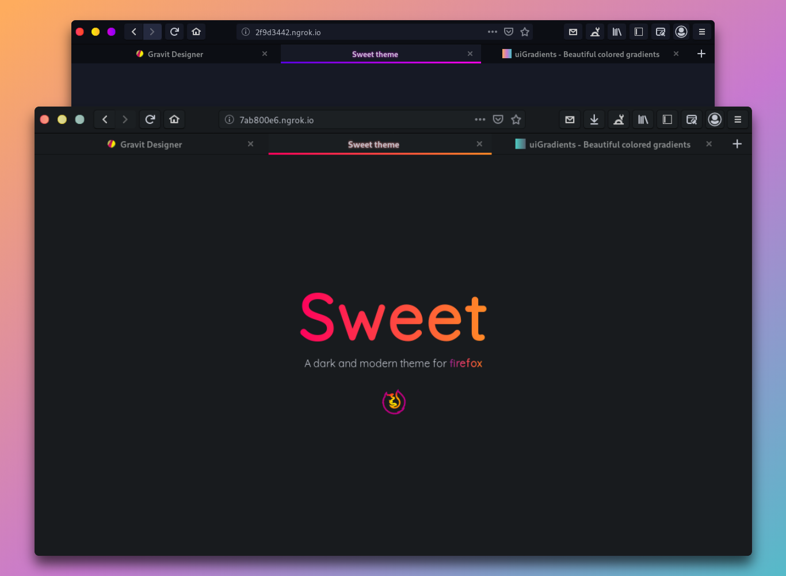

# 🦊 win-firefox-sweet-theme
A modification of EliverLara's theme firefox-sweet-theme for Windows. Works with Firefox 75.0.


## Install instructions
1. Find your Firefox Profile folder. This can be found at about:support. Scroll down the table until you find Profile Folder, then click on the Open Folder button.
2. If there is no Chrome folder, create one.
3. Copy the contents of this repository into the chrome folder.
4. In the Profile folder, add a plain-text file with the name "user.js"
5. The file's contents should be 
```
// Enable stylesheets and open the title bar.
user_pref("toolkit.legacyUserProfileCustomizations.stylesheets", true);
user_pref("browser.tabs.drawInTitlebar", false);
```
6. Install the theme Sweet-Dark at https://addons.mozilla.org/en-US/firefox/addon/sweet-dark/
7. Restart Firefox (open and close the program)
8. The theme will be complete.
